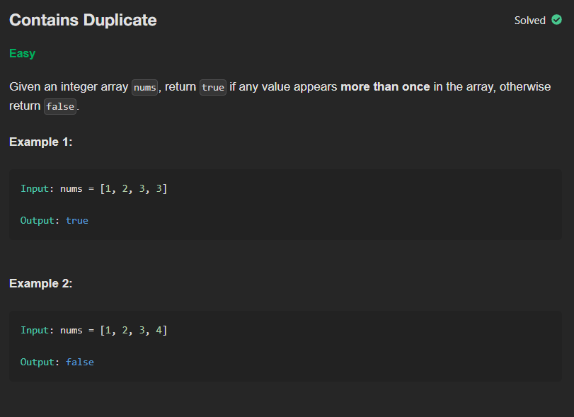

# P1 - Contians Duplicate

## Links to Practice

Neetcode - https://neetcode.io/problems/duplicate-integer  
Leetcode - https://leetcode.com/problems/contains-duplicate/

## Problem Statement

</img>

## Solutions with Time and Space Complexities

### Brute Force

```
class Solution:
    def hasDuplicate(self, nums: List[int]) -> bool:
        visited = []
        for n in nums:
            if n in visited:
                return True
            else:
                visited.append(n)
        return False
```

**Time**: O(n<sup>2</sup>)  
**Space**: O(n)

<hr/>

### Optimized

```
class Solution:
    def hasDuplicate(self, nums: List[int]) -> bool:
        nums.sort()
        for n in range(len(nums)-1):
            if nums[n] == nums[n+1]:
                return True
        return False
```

**Time**: O(n log n)  
**Space**: O(1) to O(log n)

<hr/>

### Further Optimized

```
class Solution:
    def hasDuplicate(self, nums: List[int]) -> bool:
        s = set(nums)
        if (len(s) == len(nums)):
            return False
        else:
            return True
```

**Time**: O(n)
**Space**: O(n)
