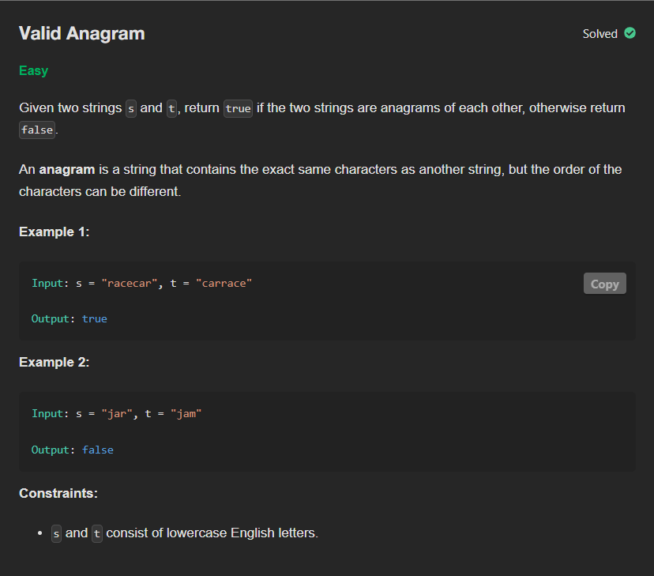

# P2 - Valid Anagram

## Links to Practice

Neetcode - https://neetcode.io/problems/is-anagram <br/>
Leetcode - https://leetcode.com/problems/valid-anagram

## Problem Statement

</img>

## Solutions with Time and Space Complexities

### Brute Force

_Converts both strings to sorted arrays and compares each character to check if they match._

```
class Solution:
    def isAnagram(self, s: str, t: str) -> bool:
        if len(s) == len(t):
            s = ''.join(sorted(s))
            t = ''.join(sorted(t))
            for i in range(len(s)):
                if s[i] != t[i]:
                    return False
            return True
        return False
```

**Time**: O(n log n) <br/>
**Space**: O(n)

<hr/>

### Optimized

_Builds frequency dictionaries for both strings and compares them to verify identical character counts._

```
class Solution:
    def isAnagram(self, s: str, t: str) -> bool:
        s_freq = {}
        t_freq = {}

        for c in s:
            if(c in s_freq.keys()):
                s_freq[c] += 1
            else:
                s_freq[c] = 1

        for c in t:
            if(c in t_freq.keys()):
                t_freq[c] += 1
            else:
                t_freq[c] = 1

        if(s_freq == t_freq):
            return True

        return False
```

**Time**: O(n + m) <br/>
**Space**: O(n)

<hr/>

### Further Optimized

_Uses a fixed-size array to track letter frequencies and ensures all counts balance to zero for an anagram._

```
class Solution:
    def isAnagram(self, s: str, t: str) -> bool:
        if len(s) != len(t):
            return False

        count = [0]*26

        for i in range(len(s)):
            count[ord(s[i]) - ord('a')] += 1
            count[ord(t[i]) - ord('a')] -= 1

        for c in count:
            if c != 0:
                return False
        return True
```

**Time**: O(n) <br/>
**Space**: O(1)
