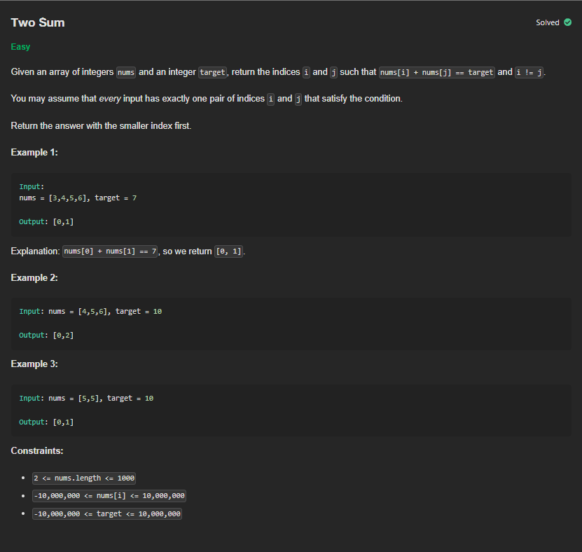

# P3 - Two Sum

## Links to Practice

Neetcode - https://neetcode.io/problems/two-integer-sum <br/>
Leetcode -

## Problem Statement

</img>

## Solutions with Time and Space Complexities

### Brute Force

```
Solution goes here
```

**Time**: <br/>
**Space**:

<hr/>

### Optimized

```
Solution goes here
```

**Time**: <br/>
**Space**:

<hr/>

### Further Optimized

```
Solution goes here
```

**Time**: <br/>
**Space**:
