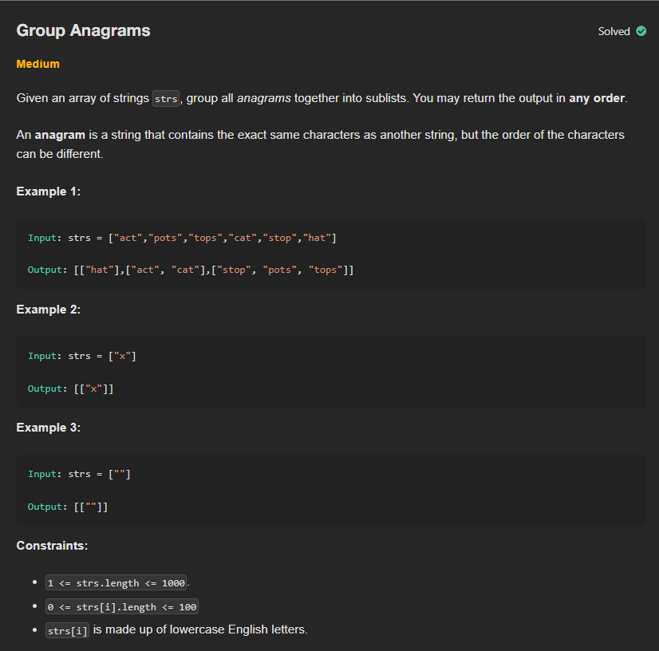

# P4 - Group Anagrams

## Links to Practice

Neetcode - https://neetcode.io/problems/anagram-groups <br/>
Leetcode - https://leetcode.com/problems/group-anagrams

## Problem Statement

</img>

## Solutions with Time and Space Complexities

### Brute Force

_Compares every word with every other word by sorting them to check if they’re anagrams._

```
class Solution:
    def groupAnagrams(self, strs: List[str]) -> List[List[str]]:
        result = []
        while strs:
            word = strs.pop(0)
            group = [word]
            for other in strs[:]:
                if sorted(word) == sorted(other):
                    group.append(other)
                    strs.remove(other)
            result.append(group)
        return result
```

**Time**: O(n² × k log k)<br/>
**Space**: O(n × k)

<hr/>

### Optimized

_Uses a dictionary with sorted tuples of each word as keys to group all anagrams together._

```
class Solution:
    def groupAnagrams(self, strs: List[str]) -> List[List[str]]:
        hash_map = defaultdict(list)
        res=[]

        for s in strs:
            key=tuple(sorted(s))
            hash_map[key].append(s)
        for i in hash_map.values():
            res.append(i)
        return res

```

**Time**: O(n \* k log k)<br/>
**Space**: O(n \* k)

<hr/>

### Further Optimized

_Groups words that are anagrams by counting letter frequencies and using those counts as keys._

```
class Solution:
    def groupAnagrams(self, strs: List[str]) -> List[List[str]]:
        if len(strs) == 0:
            return [[""]]

        if len(strs) == 1:
            return [strs]

        groups = {}
        for s in strs:
            count = [0] * 26

            for c in s:
                count[ord(c) - ord('a')] += 1

            if tuple(count) not in groups:
                groups[tuple(count)] = []
            groups[tuple(count)].append(s)

        return sorted(groups.values(),key=len)
```

**Time**: O(n \* k)<br/>
**Space**: O(n \* k)
