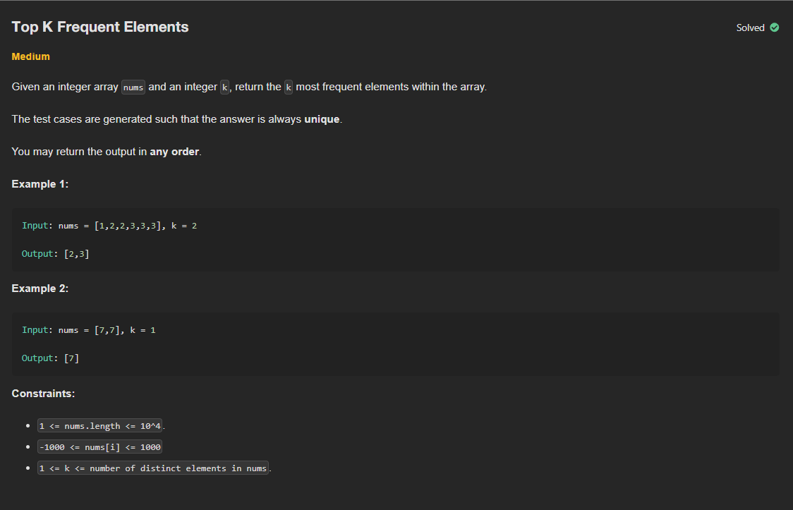

# P5 - Top K Frequent Elements

## Links to Practice

Neetcode - https://neetcode.io/problems/top-k-elements-in-list<br/>
Leetcode - https://leetcode.com/problems/top-k-frequent-elements

## Problem Statement

</img>

## Solutions with Time and Space Complexities

### Brute Force

_Builds buckets based on how many times each number appears, then collects the top k frequent ones._

```
class Solution:
    def topKFrequent(self, nums: List[int], k: int) -> List[int]:
        buckets = [[] for _ in range(len(nums))]

        for i in nums:
            bi = nums.count(i) - 1
            buckets[bi].append(i)

        res = []

        for i in range(len(buckets)-1,-1,-1):
            if len(buckets[i]) != 0:
                res.extend(set(buckets[i]))
            if len(res) == k:
                return res
```

**Time**: O(n<sup>2</sup>)<br/>
**Space**: O(n)

<hr/>

### Optimized

_Counts frequencies, sorts the elements by frequency, and returns the top k._

```
class Solution:
    def topKFrequent(self, nums: List[int], k: int) -> List[int]:
        hashmap = {}

        for i in nums:
            if i not in hashmap:
                hashmap[i] = 1
            else:
                hashmap[i] += 1

        sorted_dict = dict(sorted(hashmap.items(), key=lambda item: item[1], reverse = True))

        return list(sorted_dict.keys())[:k]
```

**Time**: O(n log n)<br/>
**Space**: O(n)

<hr/>

### Further Optimized

_Uses a frequency map and bucket sort to collect elements by occurrence count, then picks the top k._

```
class Solution:
    def topKFrequent(self, nums: List[int], k: int) -> List[int]:
        count={}
        freq = [[] for i in range(len(nums)+1)]

        for n in nums:
            count[n] = 1 + count.get(n,0)

        for n,c in count.items():
            freq[c].append(n)

        res = []
        for i in range(len(freq)-1,0,-1):
            for n in freq[i]:
                res.append(n)
                if len(res) == k:
                    return res
```

**Time**: O(n)<br/>
**Space**: O(n)
