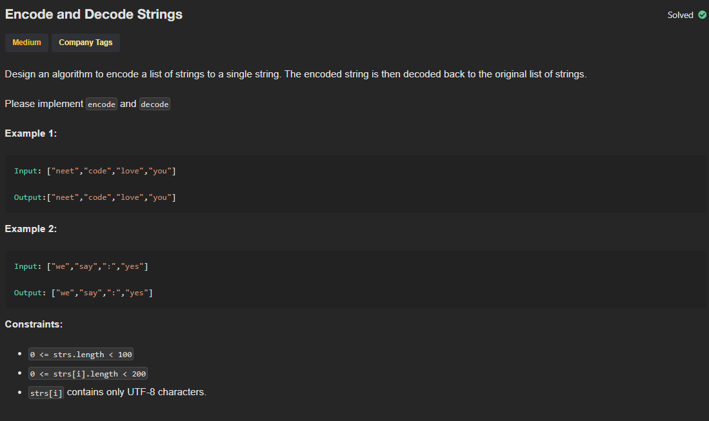

# P6 - Encode and Decode Strings

## Links to Practice

Neetcode - https://neetcode.io/problems/string-encode-and-decode <br/>
Leetcode - https://leetcode.com/problems/encode-and-decode-strings

## Problem Statement

</img>

## Solutions with Time and Space Complexities

### Brute Force

_A_

```
Solution goes here
```

**Time**: <br/>
**Space**:

<hr/>

### Optimized

_A_

```
Solution goes here
```

**Time**: <br/>
**Space**:

<hr/>

### Further Optimized

_A_

```
Solution goes here
```

**Time**: <br/>
**Space**:
