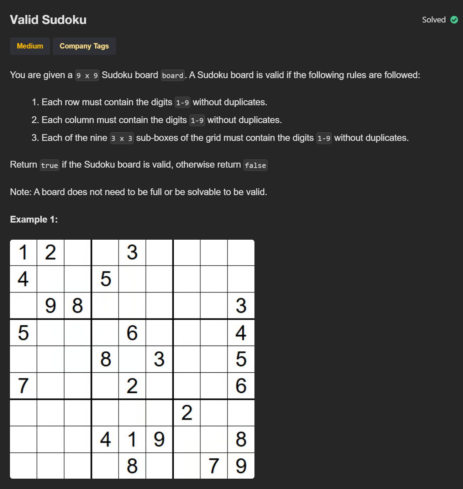

# P8 -Valid Sudoku

## Links to Practice

Neetcode - https://neetcode.io/problems/valid-sudoku/<br/>
Leetcode - https://leetcode.com/problems/valid-sudoku/

## Problem Statement

</img>

## Solutions with Time and Space Complexities

### Brute Force

_Tracks each number’s occurrence in rows, columns, and 3x3 boxes and returns false if any repeats._

```
class Solution:
    def isValidSudoku(self, board: List[List[str]]) -> bool:
        seen = set()

        for r in range(9):
            for c in range(9):
                v = board[r][c]
                if v == ".":
                    continue

                row_key = (v, "r", r)
                col_key = (v, "c", c)
                box_key = (v, "b", r//3, c//3)

                if row_key in seen or col_key in seen or box_key in seen:
                    return False

                seen.add(row_key)
                seen.add(col_key)
                seen.add(box_key)

        return True
```

**Time**: O(1)<br/>
**Space**: O(1)
